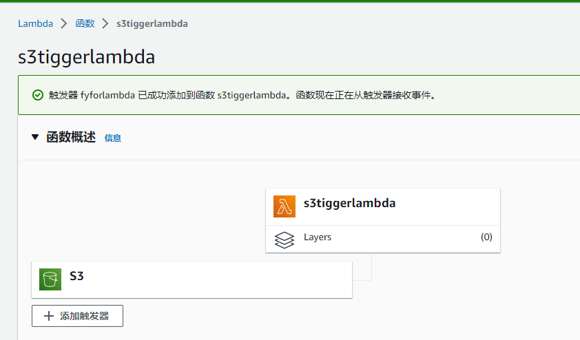

# s3 upload file trigger lambda example
## refer
### https://docs.aws.amazon.com/zh_cn/code-library/latest/ug/go_2_s3_code_examples.html
## struct
### https://docs.aws.amazon.com/zh_cn/AmazonS3/latest/userguide/notification-content-structure.html

